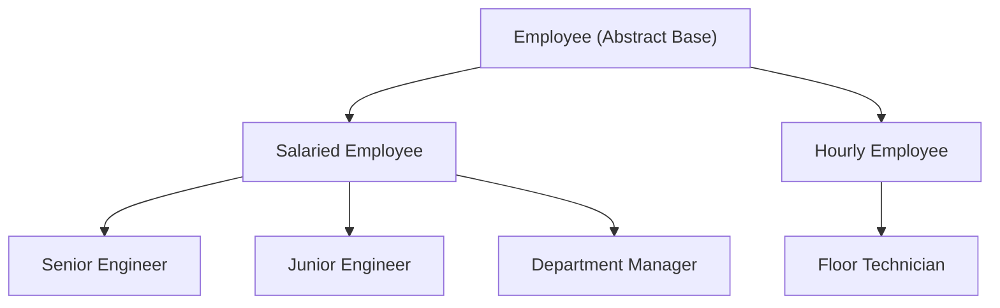

# Enterprise Employee & Budget System (OOP Case Study)

A robust C++ command-line application demonstrating advanced Object-Oriented Programming (OOP) principles through a corporate management simulation. This project manages different employee types, payroll, and a global company budget using inheritance and polymorphism.

##  Class Hierarchy (Inheritance)

The system uses a 3-level inheritance structure to categorize and specialize employee roles:



---

##  Documentation

### Level 0: Abstract Base Class
#### `Employee`
The core abstraction for all personnel in the system.

- **Attributes:**
  - `string name`: The employee's name.
  - `int id`: Unique identification number.
  - `static int totalActiveEmployees`: Global counter of current employees.
  - `static double companyBudget`: Shared pool for payroll deductions.

- **Key Methods:**
  - `virtual double simulateMonth() = 0`: Pure virtual function to log work activity and return monthly pay.
  - `virtual void displayDetails() = 0`: Pure virtual function to print employee profile.
  - `static void deductFromBudget(double amount)`: Deducts payroll from the central budget.

---

### Level 1: Intermediate Categories
#### `SalariedEmployee` (Inherits from `Employee`)
- **Attributes:** `double annualSalary`
- **Method:** `calculateMonthlyPay()` (Returns `annualSalary / 12`)

#### `HourlyEmployee` (Inherits from `Employee`)
- **Attributes:** `double hourlyRate`, `int hoursWorked`
- **Method:** `calculateMonthlyPay()` (Calculates pay based on 160 standard hours and resets `hoursWorked`)

---

### Level 2: Specialized Roles (Concrete)
These classes implement the specific `simulateMonth()` and `displayDetails()` logic.

| Class | Role | Pay Model | Base Rate/Salary |
| :--- | :--- | :--- | :--- |
| `SeniorEngineer` | Architecture & Design | Salaried | ₹50 LPA |
| `JuniorEngineer` | Coding & Training | Salaried | ₹20 LPA |
| `Manager` | Operations & Planning | Salaried | ₹30 LPA |
| `FloorTechnician` | Assembly & Maintenance | Hourly | ₹1,000/hr |

---

##  Core OOP Concepts Demonstrated

1.  **Abstraction**: The `Employee` class provides a high-level interface without specifying implementation details for `simulateMonth()`.
2.  **Inheritance**: Subclasses reuse attributes and logic from `Employee`, `SalariedEmployee`, and `HourlyEmployee`.
3.  **Polymorphism**: The system processes a list of `Employee*` pointers, calling the correct `simulateMonth()` override at runtime.
4.  **Encapsulation**: Protected members (`name`, `id`, `annualSalary`) ensure data is only accessible to relevant subclasses.
5.  **Static Members**: Global tracking of `totalActiveEmployees` and `companyBudget` across all instances.

---

##  How to Run

1.  **Compile:**
    ```bash
    g++ main.cpp -o employee_system
    ```
2.  **Execute:**
    ```bash
    ./employee_system
    ```
